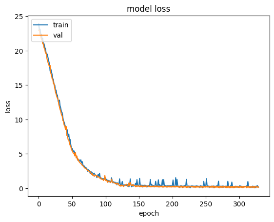
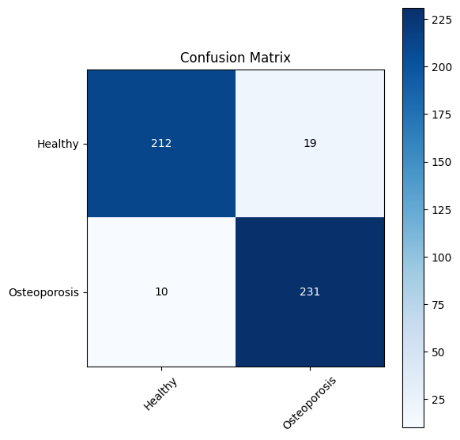

# Osteoporosis Diagnosis Using X-ray Images

### Undergraduate Thesis Project | Medical Image Analysis & Deep Learning

**Author:** Habibur Rahman  
**Student ID:** `18CSE048`  
**Degree:** B.Sc. in Computer Science and Engineering  
**Institution:** Gopalganj Science and Technology University (GSTU), Gopalganj, Bangladesh  
**Course:** CSE 478 — Undergraduate Thesis  
**Period:** Completed November 2023  

**Kaggle Notebook:** [osteoporosis-diagnosis-X-ray](https://www.kaggle.com/code/habib0155/osteoporosis-diagnosis-x-ray)  
**Thesis Report:** [`Thesis_Report_4_2.pdf`](Thesis_Report_4_2.pdf)

---

## Abstract

Osteoporosis degrades bone quality and is a major cause of fractures among the elderly and postmenopausal women. Although Dual-Energy X-ray Absorptiometry (DXA) is the clinical standard for measuring Bone Mineral Density (BMD), it remains relatively costly and less accessible in many settings. Conventional X-ray imaging, by contrast, is widely available and inexpensive.

This thesis investigates a **computer-aided diagnosis (CAD)** approach that uses **Convolutional Neural Networks (CNNs)** and **transfer learning** to detect osteoporosis from knee X-ray images. The study addresses an underexplored anatomical site—knee osteoporosis—and demonstrates that deep learning can support early screening from routine radiographs, with the potential to reduce fracture risk through timely intervention.

**Keywords:** Deep Learning, Convolutional Neural Network (CNN), Transfer Learning, Medical Image Analysis, Osteoporosis Diagnosis, Knee X-ray

---

## Research Motivation

Osteoporosis is clinically assessed using DXA-derived T-score and Z-score values approved by the World Health Organization (WHO). Alternative modalities such as Quantitative Ultrasound (QUS), CT, and MRI each have limitations related to cost, radiation dose, site specificity, or accessibility.

Prior deep learning CAD systems for osteoporosis have mainly focused on the **hip, spine, hand, and teeth**. Knee osteoporosis remains comparatively understudied. Detecting osteoporosis from knee radiographs is attractive because:

- X-ray imaging is inexpensive and widely available  
- Knee imaging avoids unnecessary radiation exposure to vital organs  
- Automated screening can assist clinicians in early-stage detection  

This project therefore focuses on **deep learning–based classification of knee X-ray images** for osteoporosis diagnosis.

---

## Research Objectives

1. Study existing CAD and deep learning methods for osteoporosis detection across different skeletal sites  
2. Design a CNN-based pipeline for classifying knee X-ray images related to bone health  
3. Apply **transfer learning** with pretrained CNN architectures to improve performance on limited medical data  
4. Evaluate and compare model performance using standard classification metrics  
5. Discuss the feasibility of a low-cost, X-ray–based early screening system  

---

## Key Contributions

- Conducted a literature review of CNN-based osteoporosis diagnosis from MRI, CT, hip radiographs, hand X-rays, and pelvic images  
- Identified **knee osteoporosis** as an underexplored but clinically relevant research direction  
- Developed an end-to-end deep learning pipeline for knee X-ray classification using transfer learning  
- Aggregated multiple public knee X-ray datasets to strengthen training diversity  
- Achieved **93.9% test accuracy** with an Xception-based model for binary Healthy vs Osteoporosis classification  
- Documented the full research process in an undergraduate thesis report and a reproducible Kaggle notebook  

---

## Methodology

### Overall Pipeline

```text
Knee X-ray Dataset
        │
        ▼
Preprocessing (resize, normalize)
        │
        ▼
Data Augmentation (training set)
        │
        ▼
CNN / Transfer Learning Model
        │
        ▼
Classification Output
(Healthy / Osteoporosis)
        │
        ▼
Evaluation
(Accuracy, Precision, Recall, F1, Confusion Matrix)
```

### Thesis Framework

The thesis proposes a CAD framework in which knee X-ray images are collected, split into training and testing sets, augmented, and passed to CNN classifiers. The study discusses popular pretrained architectures including:

- AlexNet  
- ResNet-18  
- VGGNet-16  
- VGGNet-19  

These models are considered for classifying bone-condition–related radiographic patterns. The thesis also references three clinically meaningful groups often used in osteoporosis research—**normal**, **osteopenia**, and **osteoporosis**—based on BMD-related assessment such as QUS-derived T-scores.

### Implemented Experimental Pipeline

The accompanying notebook implements a practical binary classification system (`Healthy` vs `Osteoporosis`) with the following design:

| Component | Details |
|-----------|---------|
| Task | Binary image classification |
| Backbone | **Xception** (ImageNet pretrained) |
| Input size | `224 × 224 × 3` |
| Classifier head | Global Average Pooling → Dense(1024) → Dense(512) → Dense(224) → Softmax(2) |
| Regularization | L2 weight decay, Batch Normalization, Dropout (0.5) |
| Optimizer | Adam (`learning_rate = 1e-4`) |
| Loss | Categorical cross-entropy |
| Training aids | Class weights, Early Stopping, ReduceLROnPlateau |
| Augmentation | Rotation, width/height shift, shear, zoom, horizontal flip, brightness adjustment |

Fine-tuning was applied by unfreezing the final layers of the pretrained backbone, allowing the model to adapt ImageNet features to medical radiographic patterns.

---

## Datasets

Public knee X-ray datasets from Kaggle were combined to form the experimental corpus:

| # | Dataset | Link |
|---|---------|------|
| 1 | Osteoporosis Database | [mohamedgobara/osteoporosis-database](https://www.kaggle.com/datasets/mohamedgobara/osteoporosis-database) |
| 2 | Osteoporosis | [mrmann007/osteoporosis](https://www.kaggle.com/datasets/mrmann007/osteoporosis) |
| 3 | Osteoporosis Knee Dataset (Preprocessed 128×256) | [sachinkumar413/osteoporosis-knee-dataset-preprocessed128x256](https://www.kaggle.com/datasets/sachinkumar413/osteoporosis-knee-dataset-preprocessed128x256) |
| 4 | Osteoporosis Knee X-ray Dataset | [stevepython/osteoporosis-knee-xray-dataset](https://www.kaggle.com/datasets/stevepython/osteoporosis-knee-xray-dataset) |

**Additional thesis reference:** [Mendeley Dataset (fxjm8fb6mw)](https://data.mendeley.com/datasets/fxjm8fb6mw/2)

### Dataset Statistics (Notebook Experiment)

| Class | Number of Images |
|-------|------------------|
| Healthy | 780 |
| Osteoporosis | 793 |
| **Total** | **1,573** |

Approximate data split:

| Split | Size |
|-------|------|
| Training | ~1,258 |
| Validation | ~315 |
| Test | ~472 |

---

## Experimental Results

The final Xception-based model achieved strong performance on the held-out test set:

| Metric | Score |
|--------|-------|
| **Test Accuracy** | **93.9%** |
| Macro Precision | 0.94 |
| Macro Recall | 0.94 |
| Macro F1-score | 0.94 |

### Per-Class Performance

| Class | Precision | Recall | F1-score | Support |
|-------|-----------|--------|----------|---------|
| Healthy | 0.95 | 0.92 | 0.94 | 231 |
| Osteoporosis | 0.92 | 0.96 | 0.94 | 241 |

These results indicate that transfer learning with a modern CNN backbone can effectively distinguish osteoporotic and healthy knee radiographs under the evaluated experimental setting.

### Training Loss Curve

The figure below shows training and validation loss over epochs for the Xception model. Both curves decrease steadily and converge to a low value, indicating stable learning without severe overfitting.

<p align="center">
  
</p>

<p align="center"><em>Figure 1. Training and validation loss of the Xception model across epochs.</em></p>

### Confusion Matrix

The confusion matrix on the test set (472 images) reports **212** correctly classified Healthy cases and **231** correctly classified Osteoporosis cases, with **19** and **10** misclassifications respectively.

<p align="center">
  
</p>

<p align="center"><em>Figure 2. Confusion matrix of the Xception model on the test set.</em></p>

---

## Repository Structure

```text
osteoporosis-diagnosis-X-ray-4-2/
├── images/
│   ├── confusion_matrix_Xception.png      # Test-set confusion matrix
│   └── loss_vs_epoch_graph_Xception.png   # Training / validation loss curve
├── Thesis_Report_4_2.pdf                  # Undergraduate thesis report
├── osteoporosis-diagnosis-x-ray.ipynb     # Training & evaluation notebook
└── README.md                              # Project documentation
```

---

## How to Reproduce

### Option A — Kaggle (Recommended)

1. Open the notebook: [https://www.kaggle.com/code/habib0155/osteoporosis-diagnosis-x-ray](https://www.kaggle.com/code/habib0155/osteoporosis-diagnosis-x-ray)  
2. Click **Copy & Edit**  
3. Attach the four datasets listed above  
4. Enable a GPU accelerator and run all cells  

### Option B — Local Environment

1. Clone this repository  
2. Install Python dependencies (`tensorflow` / `keras`, `scikit-learn`, `pandas`, `numpy`, `matplotlib`)  
3. Download the Kaggle datasets and update the file paths in the notebook  
4. Execute `osteoporosis-diagnosis-x-ray.ipynb` sequentially  

> Paths in the notebook follow Kaggle’s `/kaggle/input/...` convention and must be adjusted for local runs.

---

## Technologies Used

- **Language:** Python  
- **Deep Learning:** TensorFlow / Keras  
- **Model:** Xception (Transfer Learning)  
- **Data & Evaluation:** NumPy, Pandas, scikit-learn  
- **Visualization:** Matplotlib  
- **Platform:** Kaggle Notebooks (GPU)

---

## Related Work (Selected)

This thesis builds on prior research in medical image–based osteoporosis analysis, including:

- Proximal femur MRI segmentation with deep CNNs (Deniz et al.)  
- CT-based bone condition detection with MS-Net / BCC-Net (Tang et al.)  
- Pelvic X-ray osteoporosis diagnosis with improved U-Net (Liu et al.)  
- Hip radiograph classification with EfficientNet and clinical covariates (Yamamoto et al.)  
- Hand X-ray osteoporosis screening with AlexNet (Tecle et al.)  
- Knee radiographic parameters correlated with BMD and T-score (He et al.)  

A full reference list is available in [`Thesis_Report_4_2.pdf`](Thesis_Report_4_2.pdf).

---

## Future Research Directions

This undergraduate work establishes a foundation for further research in medical AI. Planned extensions include:

1. Expanding datasets with more diverse patient demographics and imaging conditions  
2. Extending classification from binary detection to multi-stage diagnosis (**normal / osteopenia / osteoporosis**)  
3. Investigating cross-site generalization (knee vs hip, spine, and other skeletal regions)  
4. Integrating clinical covariates (age, gender, fracture history, lifestyle factors) with imaging features  
5. Exploring explainable AI (Grad-CAM / attention maps) for clinically interpretable predictions  
6. Developing a lightweight screening prototype suitable for low-resource healthcare settings  

These directions align with graduate-level research interests in **medical image analysis, deep learning, and intelligent healthcare systems**.

---

## Academic Context

This repository documents the author’s undergraduate thesis research in **Computer Science and Engineering**, with emphasis on:

- Medical image analysis  
- Convolutional neural networks  
- Transfer learning for small biomedical datasets  
- Experimental design, evaluation, and scientific reporting  

It is intended as supporting material for **MSc applications** in Artificial Intelligence, Computer Vision, Medical Informatics, and related fields.

---

## License

The associated Kaggle notebook is released under the **Apache 2.0** license.

---

## Acknowledgments

Department of Computer Science and Engineering,  
Gopalganj Science and Technology University (GSTU), Gopalganj, Bangladesh.

---

## Disclaimer

This project is an **academic research prototype**. It is **not** a certified medical device and must not be used as a substitute for professional clinical diagnosis.
